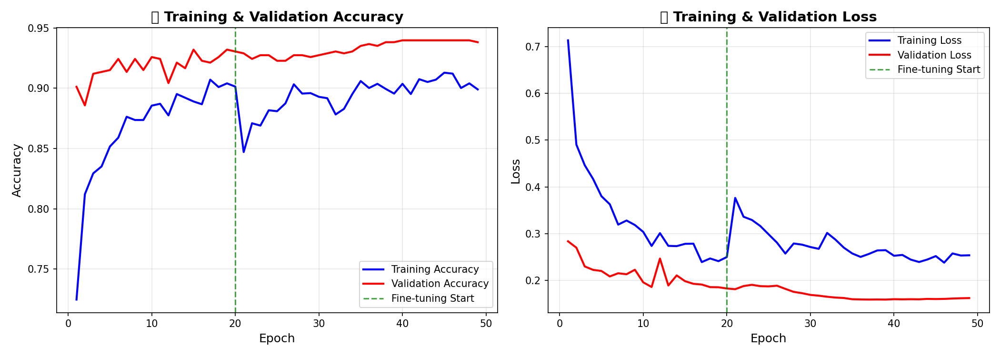

# TernakCare

Capstone project Bangkit Academy - Sistem deteksi penyakit ternak berbasis computer vision menggunakan MobileNetV2 dengan transfer learning.

## Tentang Project

TernakCare dikembangkan untuk membantu peternak dan dokter hewan dalam mendeteksi penyakit pada sapi secara cepat melalui analisis gambar. Sistem ini mampu mengenali tiga kondisi:

- **Healthy** - Sapi dalam kondisi sehat
- **Lumpy Skin Disease (LSD)** - Penyakit kulit menular dengan ciri benjolan/nodul
- **Foot and Mouth Disease (FMD)** - Penyakit mulut dan kuku dengan lesi di mulut dan kaki

## Hasil Training

Model mencapai validation accuracy sekitar 94% setelah fine-tuning. Training dilakukan dalam dua fase:
1. Feature extraction (20 epoch) - melatih classifier head
2. Fine-tuning (30 epoch) - membuka sebagian layer MobileNetV2



## Cara Pakai

### Setup Environment

```bash
# Clone repo
git clone https://github.com/m1neeS/TernakCare.git
cd TernakCare

# Buat virtual environment
python -m venv venv
venv\Scripts\activate  # Windows
source venv/bin/activate  # Linux/Mac

# Install dependencies
pip install -r requirements.txt
```

### Jalankan Web App (Streamlit)

```bash
streamlit run app.py
```
Buka `http://localhost:8501` di browser.

### Jalankan REST API (FastAPI)

```bash
uvicorn api:app --reload --port 8000
```

API Endpoints:
- `GET /` - Info API
- `GET /health` - Health check
- `GET /classes` - Daftar kelas penyakit
- `POST /predict` - Upload gambar untuk prediksi
- `GET /docs` - Swagger documentation

Contoh request:
```bash
curl -X POST "http://localhost:8000/predict" -F "file=@gambar_sapi.jpg"
```

### Inference Manual

```python
import tensorflow as tf
import numpy as np
from PIL import Image

model = tf.keras.models.load_model('ternakcare_best_model.keras')
class_names = ['foot-and-mouth', 'healthy', 'lumpy']

img = Image.open('gambar.jpg').resize((224, 224))
img_array = np.array(img) / 255.0
img_array = np.expand_dims(img_array, axis=0)

pred = model.predict(img_array)
print(f"{class_names[np.argmax(pred[0])]} - {np.max(pred[0])*100:.1f}%")
```

## Struktur Project

```
TernakCare/
├── app.py                              # Streamlit web app
├── api.py                              # FastAPI REST API
├── TernakCare_Disease_Detection.ipynb  # Training notebook
├── ternakcare_best_model.keras         # Model terbaik (checkpoint)
├── ternakcare_final_model.keras        # Model final
├── class_indices.json                  # Mapping class index
├── model_config.json                   # Konfigurasi model
├── requirements.txt                    # Dependencies
└── data/                               # Dataset (tidak di-push)
    ├── healthy/
    ├── lumpy/
    └── foot-and-mouth/
```

## Tech Stack

- Python 3.11
- TensorFlow/Keras 2.x
- MobileNetV2 (pretrained ImageNet)
- Streamlit (Web UI)
- FastAPI (REST API)

## Dataset

Dataset terdiri dari gambar sapi dengan berbagai kondisi:
- Healthy: ~900 gambar
- Lumpy: ~1000 gambar  
- Foot-and-mouth: ~600 gambar

Dataset tidak di-include di repo karena ukurannya besar.

## Bangkit Academy

Project ini merupakan capstone project yang dikembangkan selama mengikuti program Bangkit Academy.

## License

MIT
